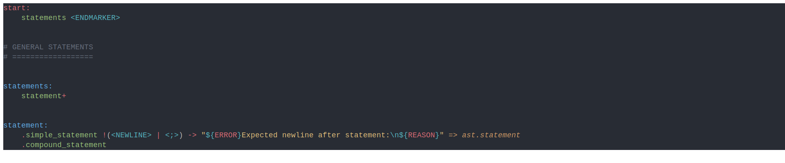

# ButterSus's Language Grammar Syntax Highlighting

Visual Studio Code extension, that provides you basic syntax highlighting for your code. 🖌

> **Note:** This extension is still in development and can cause some unexpected bugs.

## License

Licensed under of

* [MIT License](LICENSE)
